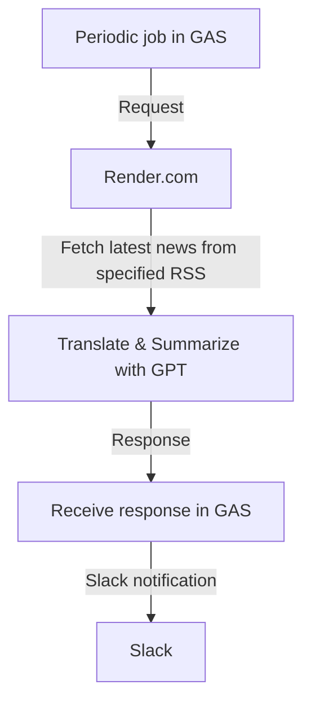

# todays_news_notifier_with_gpt
Translate and summarize daily news with ChatGPT.

# Architecture

# Targeted Sources
| SiteName | RSS feed URL |
|----------|-----------------|
| Search Engine Journal | https://www.searchenginejournal.com/feed/ |
| Moz Blog | https://moz.com/blog/feed |
| CSS-Tricks | https://css-tricks.com/feed/ |
| Frontend Focus | https://frontendfoc.us/rss |
| The New Stack | https://thenewstack.io/feed/ |
| DZone Deployment | https://feeds.dzone.com/deployment |
| DZone Databases | https://feeds.dzone.com/databases |
| GitHub Blog | https://github.blog/feed/ |
| DevOps.com | https://devops.com/feed/ |
| The Cloudflare Blog | https://blog.cloudflare.com/rss/ |
| Engineering Management Institute | https://engineeringmanagementinstitute.org/feed/ |
| LeadDev | https://leaddev.com/content-piece-and-series/rss.xml |
| The Hacker News | https://feeds.feedburner.com/TheHackersNews |
| Krebs on Security | https://krebsonsecurity.com/feed/ |
| TechCrunch | https://techcrunch.com/feed/ |

# How To Use
1. fork or clone this repository
2. `cd app`
3. `cp .env.example .env` and set your open ai api key
4. `cargo build`
5. `cargo run`
6. `curl http://localhost:3030/health` or `curl http://localhost:3030/summaries`
